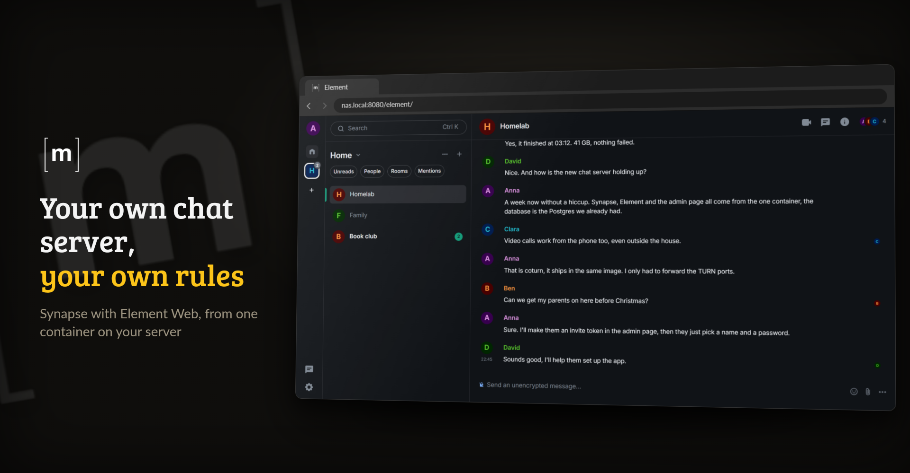
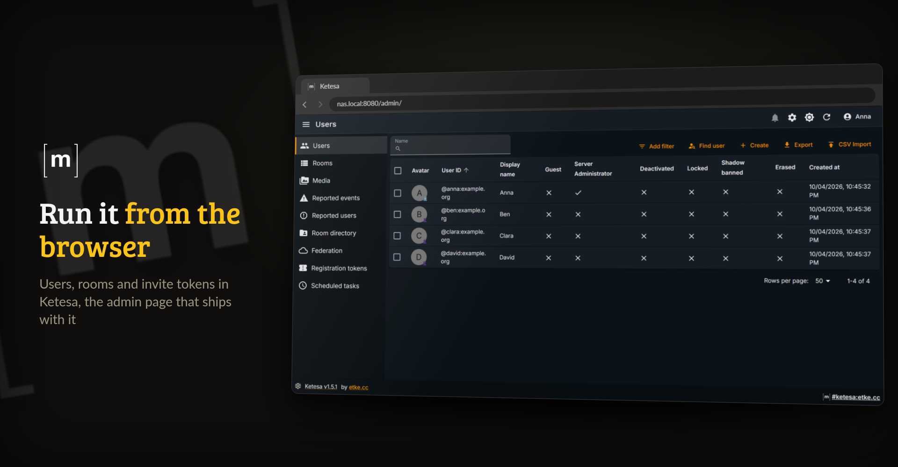

<p align="center">
  <picture>
    <source media="(prefers-color-scheme: dark)" srcset="https://raw.githubusercontent.com/junkerderprovinz/matrix/main/.github/assets/matrix-banner-dark.png">
    
  </picture>
</p>

<p align="center">
  <a href="https://github.com/junkerderprovinz/matrix/actions/workflows/build.yml"></a>&nbsp;
  <a href="https://github.com/junkerderprovinz/matrix/actions/workflows/lint.yml"></a>&nbsp;
  <a href="https://hub.docker.com/r/junkerderprovinz/matrix"></a>&nbsp;
  <a href="https://hub.docker.com/r/junkerderprovinz/matrix"></a>&nbsp;
  <a href="https://github.com/junkerderprovinz/matrix/pkgs/container/matrix"></a>&nbsp;
  <a href="https://github.com/element-hq/synapse"></a>&nbsp;
  <a href="https://element.io"></a>&nbsp;
  <a href="https://ca.unraid.net/apps/matrix-0m1y9gx19lbqgt"></a>&nbsp;
  <a href="LICENSE"></a>
</p>

<p align="center">

<p align="center">
A Docker image for running your own <b>Matrix homeserver</b> on Unraid.
No manual config file editing and no SSH access to the container required.
Enter your domain and database credentials and the container handles the rest.
</p>

<!-- download-buttons: written by scripts/gen_download_buttons.py -->
<p align="center">
  <a href="https://ca.unraid.net/apps/matrix-0m1y9gx19lbqgt"></a>
  &nbsp;
  <a href="https://hub.docker.com/r/junkerderprovinz/matrix/"></a>
  &nbsp;
  <a href="https://github.com/junkerderprovinz/matrix/releases/latest"></a>
</p>
<!-- /download-buttons -->

<br>

<p align="center">
A one-knight job: I build it, keep it running, work through the issues and add what people ask for, until nothing is missing. It is free, with no accounts, no telemetry, no ads and no paid tier. No asterisk anywhere. Nothing readable ever leaves your own walls. Forged on evenings and weekends, with heart and stubbornness.
</p>

<p align="center">
If it has earned a place on your server or computer, toss a coin to your knight: it helps cover the costs and keeps the project alive. It also makes this knight's heart beat a little faster. Three ways below, whichever suits you.
</p>

<!-- give-buttons: written by scripts/gen_download_buttons.py -->
<p align="center">
  <a href="https://buymeacoffee.com/junkerderprovinz"></a>
  &nbsp;
  <a href="https://www.paypal.com/donate/?hosted_button_id=76FVV52TKXTUS"></a>
  &nbsp;
  <a href="https://junkerderprovinz.github.io/junkerderprovinz/"></a>
</p>
<!-- /give-buttons -->

<br>

## ⚠️ Before you start

> [!IMPORTANT]
> **Two things outside the container have to be right, or Synapse will not work.**
>
> 1. **The PostgreSQL database needs UTF8 with `C` collation.** With any other locale Synapse refuses to start. The `CREATE DATABASE` command is in [step 1 of Getting started](#3-getting-started).
> 2. **The reverse proxy needs the Matrix block in its custom Nginx configuration.** Without it media uploads fail and syncing times out. The block is in step 3 of the same section.

<br>

## Table of Contents

1. [What it looks like](#1-what-it-looks-like)
2. [What it does](#2-what-it-does)
3. [Getting started](#3-getting-started)
4. [How AI is used here](#4-how-ai-is-used-here)
5. [Support this project](#5-support-this-project)

<br>

## 1. What it looks like

The people, rooms and messages in these pictures are made up.

<p align="center">
  
  <br><em>Element Web, served by the container itself, talking to your own Synapse</em>
</p>

<p align="center">
  
  <br><em>Ketesa, the admin page in the same image, for users, rooms and registration tokens</em>
</p>

<br>

## 2. What it does

- **Everything a homeserver needs, in one image.** It builds on Element's official Synapse image and adds Element Web, the Ketesa admin page, coturn for voice and video calls, and Prometheus metrics. Only PostgreSQL stays outside, so your backups and database stay yours.
- **Configured from the template.** The container writes Synapse's config on every start from the fields you fill in, so a change is an edit in Unraid followed by a restart.
- **Federation without hand-written JSON.** Synapse serves the `.well-known` delegation itself, and a reverse proxy in front of it is all federation needs. Switch it off and the server stays a private island.
- **A first admin without a console.** Set `ADMIN_USER` and `ADMIN_PASSWORD` once and the account is created, or an existing one is promoted to server admin.
- **Optional extras, off by default.** QR code login through the Matrix Authentication Service, media on S3 storage, and bridges loaded from `/data/appservices/` are each one setting away.
- **Nothing ships blind.** Every build boots against a throwaway PostgreSQL and fails if Synapse is not really running on it, and every image is scanned for CVEs.

<br>

## 3. Getting started

You need a PostgreSQL server and a reverse proxy with HTTPS (Nginx Proxy Manager, SWAG, Traefik or a Cloudflare Tunnel).

**1. Create the database.** Synapse refuses to start unless the database is UTF8 with `C` collation. In your Postgres console (`psql -U postgres`):

```sql
CREATE USER matrix WITH PASSWORD 'yoursecretpassword';
CREATE DATABASE matrix
    ENCODING 'UTF8' LC_COLLATE='C' LC_CTYPE='C'
    TEMPLATE template0 OWNER matrix;
```

**2. Install the container.** On Unraid, install **Matrix** from [Community Applications](https://ca.unraid.net/apps/matrix-0m1y9gx19lbqgt) and fill in `SERVER_NAME` (for example `matrix.yourdomain.tld`) and the `POSTGRES_*` fields. Use your server's IP for `POSTGRES_HOST`, since container names only resolve on a custom Docker network. `SERVER_NAME` becomes part of every user ID (`@name:matrix.yourdomain.tld`) and cannot be changed later without starting over. Anywhere else:

```sh
docker run -d --name matrix -p 8008:8008 -p 8080:8080 \
  -e SERVER_NAME=matrix.yourdomain.tld \
  -e POSTGRES_HOST=192.168.1.10 -e POSTGRES_USER=matrix \
  -e POSTGRES_PASSWORD=yoursecretpassword -e POSTGRES_DB=matrix \
  -e ADMIN_USER=admin -e ADMIN_PASSWORD=change-me \
  -v /path/to/data:/data \
  junkerderprovinz/matrix:latest
```

After 30 to 60 seconds the log shows `MATRIX IS READY`. Clear `ADMIN_USER` and `ADMIN_PASSWORD` once the admin exists.

**3. Put the proxy in front.** Point `matrix.yourdomain.tld` at port `8008` with WebSockets on, and add this to the proxy host's custom Nginx configuration (in Nginx Proxy Manager: Edit, Advanced), or media uploads fail and syncing times out:

```nginx
client_max_body_size 100M;
proxy_read_timeout 600s;
proxy_send_timeout 600s;
proxy_set_header X-Forwarded-For $remote_addr;
proxy_set_header X-Forwarded-Proto $scheme;
proxy_set_header Host $host;
proxy_http_version 1.1;
proxy_set_header Upgrade $http_upgrade;
proxy_set_header Connection "upgrade";
```

A path-based proxy has to forward all of `/_matrix` and `/_synapse`, or the admin page reports a server communication error. Then check federation with the [federation tester](https://federationtester.matrix.org/).

**4. Sign in.** Element Web is on port `8080` under `/element/` and Ketesa under `/admin/`. For voice and video calls, forward the TURN ports (`3478` and the relay range `49160-49200/udp`) to your server, since a reverse proxy cannot carry them, and set `TURN_EXTERNAL_IP` to your public IP when the server is behind NAT.

The database, the proxy, federation, monitoring, bridges, admin users, registration tokens, delegated auth, S3 media, Element Call for Element X, updates and troubleshooting are explained step by step in the [setup guide](docs/setup.md).

<br>

## 4. How AI is used here

One knight builds this, and AI is one of the tools I work with, the same way I work with an editor or a compiler. It helps me write code and documentation and it checks my work, and that saves me a good many evenings. It does not make the decisions, though. I read and understand everything before it ships, and if something here breaks, that is on me and not on the tool.

You do not have to take my word for it. The code is open and every release note is written by hand. The issue tracker shows how problems actually get handled, including the ones I got wrong the first time. If you find something that is not right, open an issue and I will look at it.

<br>

## 5. Support this project

Questions? Check the [support thread](https://forums.unraid.net/topic/198818-support-junkerderprovinz-matrix-aio/). Bugs, ideas or feature requests? Please [open a GitHub issue](https://github.com/junkerderprovinz/matrix/issues).

A one-knight job: I build it, keep it running, work through the issues and add what people ask for, until nothing is missing. It is free, with no accounts, no telemetry, no ads and no paid tier. No asterisk anywhere. Nothing readable ever leaves your own walls. Forged on evenings and weekends, with heart and stubbornness.

If it has earned a place on your server or computer, toss a coin to your knight: it helps cover the costs and keeps the project alive. It also makes this knight's heart beat a little faster. Three ways below, whichever suits you.

<!-- give-buttons: written by scripts/gen_download_buttons.py -->
<p align="center">
  <a href="https://buymeacoffee.com/junkerderprovinz"></a>
  &nbsp;
  <a href="https://www.paypal.com/donate/?hosted_button_id=76FVV52TKXTUS"></a>
  &nbsp;
  <a href="https://junkerderprovinz.github.io/junkerderprovinz/"></a>
</p>
<!-- /give-buttons -->

<br>

<sub>Not affiliated with Element, the Matrix.org Foundation or the coturn project. Synapse, Element Web, Ketesa and coturn are used unmodified under their own licences; the packaging here is AGPL-3.0, see [LICENSE](LICENSE).</sub>
